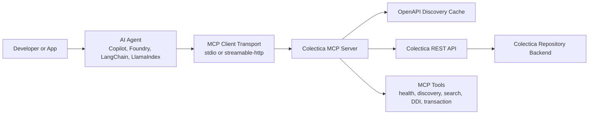
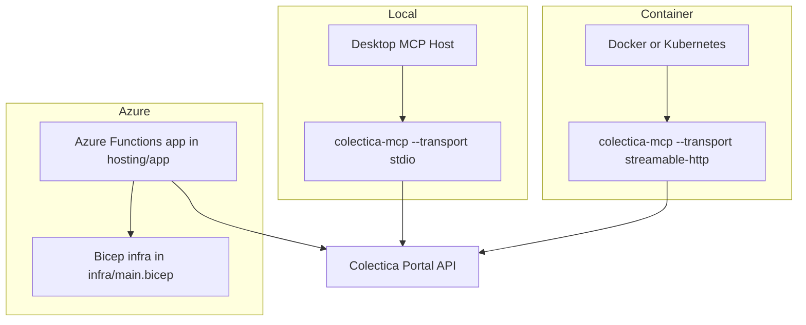
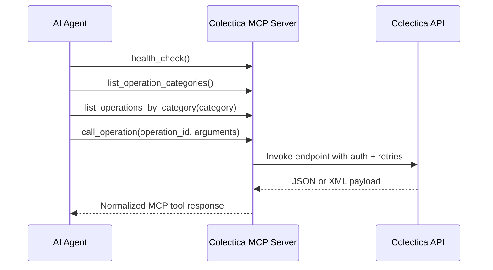

# Colectica MCP Server

MCP server for Colectica Repository REST API with:

- OpenAPI/Swagger discovery
- operation invocation by OpenAPI operationId or synthesized id (`METHOD_path_segments`)
- Basic Auth and Bearer Token support
- stdio transport now, optional streamable-http transport switch

## 1. Install

```powershell
python -m venv .venv
.\.venv\Scripts\Activate.ps1
pip install -e .
```

## 2. Configure

Copy `.env.example` to `.env` and set values:

- `COLECTICA_BASE_URL` (your Colectica Portal URL)
- either `COLECTICA_BEARER_TOKEN` or `COLECTICA_USERNAME` + `COLECTICA_PASSWORD` (or both)

Optional:

- `COLECTICA_OPENAPI_CACHE_TTL_SECONDS` (default `300`; set `0` to disable cache)
- `COLECTICA_RETRY_MAX_RETRIES` (default `2`)
- `COLECTICA_RETRY_BASE_SECONDS` (default `0.5`)
- `COLECTICA_RETRY_MAX_SECONDS` (default `8`)

## 3. Run MCP server

### stdio (default)

```powershell
colectica-mcp --transport stdio
```

### streamable-http (optional)

```powershell
colectica-mcp --transport streamable-http --mount-path /mcp
```

## 4. Architecture and hosting diagrams

### 4.1 Runtime request flow



### 4.2 Hosting options



### 4.3 AI-agent integration pattern



### 4.4 Host and configure for AI agents

1. Pick transport: `stdio` for local desktop agent clients, `streamable-http` for remote/containerized clients.
2. Configure environment variables in `.env`:
   - `COLECTICA_BASE_URL`
   - Auth values (`COLECTICA_BEARER_TOKEN` or `COLECTICA_USERNAME` + `COLECTICA_PASSWORD`)
   - Optional retry/cache tuning values
3. Start the server with your chosen transport.
4. Register this MCP endpoint in your AI agent runtime.
5. Initialize agents with discovery-first calls: `health_check`, `list_operations`, then scoped execution calls.

## 5. Available MCP tools

- `health_check(auth_mode="auto")`
- `list_operations(auth_mode="auto")`
- `find_operations(query, auth_mode="auto", limit=50)`
- `find_ddi_operations(auth_mode="auto", limit=50)`
- `call_operation(operation_id, arguments, auth_mode="auto")`
- `call_endpoint(method, path, arguments, auth_mode="auto")`
- `operation_details(operation_id, auth_mode="auto")`
- `call_operation_paginated(operation_id, arguments, auth_mode="auto", max_pages=20, items_path=None)`
- `list_operation_categories(auth_mode="auto")`
- `list_operations_by_category(category, auth_mode="auto", limit=200)`
- `get_repository_info(auth_mode="auto")`
- `get_item(arguments, auth_mode="auto")`
- `search(arguments, auth_mode="auto")`
- `register_item(arguments, auth_mode="auto")`
- `get_item_by_urn(urn, auth_mode="auto")`
- `register_item_body(body, auth_mode="auto")`
- `get_ddi_fragment(agency, identifier, version=None, auth_mode="auto")`
- `get_ddi_set_fragment(agency, identifier, version=None, auth_mode="auto")`
- `get_item_json(agency, identifier, version=None, auth_mode="auto")`
- `get_item_json_set(agency, identifier, version=None, auth_mode="auto")`
- `get_item_json_set_filtered(body, auth_mode="auto")`

## 6. Recommended usage flow

1. `health_check`
2. `list_operations`
3. `list_operation_categories` to see API groups (Agency, Comment, Ddi, Event, Item, Permission, Query, Rating, Replication, Repository, Set, Setting, Tag, Token, Transaction, VersionNumber)
4. `list_operations_by_category` to narrow to one group
5. `call_operation` using operationId and arguments from your Swagger schema

For request bodies, pass `arguments.body`.

If you prefer to execute directly from HTTP route + verb, use `call_endpoint(method, path, arguments, auth_mode)`.

If your OpenAPI spec does not provide operationId values, use synthesized ids in this format:

- `METHOD_<normalized_path>`
- Example: `GET /api/v1/ddi/{agency}/{identifier}` -> `GET_api_v1_ddi_agency_identifier`

Optional for non-JSON operations:

- `arguments.content_type` (for example `application/x-www-form-urlencoded` or `multipart/form-data`)

Use `operation_details` to inspect supported parameters and request body content types before invoking.
For paged endpoints, use `call_operation_paginated` to aggregate items across pages. The server will follow continuation tokens when available, including body tokens like `nextResult` for query endpoints.

## 7. DDI integration workflow

Use this sequence to integrate with DDI-focused Colectica endpoints:

1. Call convenience wrappers directly: `get_ddi_fragment`, `get_ddi_set_fragment`, `get_item_json`, `get_item_json_set`.
2. Use `get_item_json_set_filtered` for selective graph traversal.
3. For advanced/non-wrapped routes, run `find_ddi_operations` and confirm with `operation_details(operation_id)`.
4. Execute custom integration calls via `call_operation` using typed `arguments` and `arguments.body`.
5. For large result sets, switch to `call_operation_paginated`.

## 8. Verification commands

Run Colectica server tool unit tests locally:

```powershell
python -m unittest tests/test_server_tools.py tests/test_client_pagination.py -v
```

## License

This project is licensed under the Apache License 2.0.
See the [LICENSE](LICENSE) file for details.

