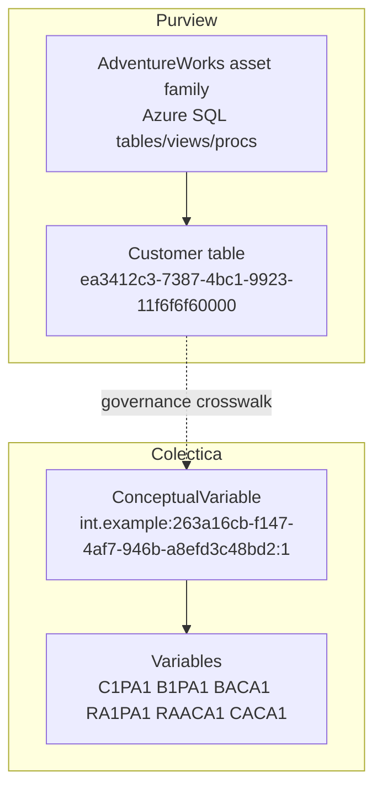

# AdventureWorks to Colectica Crosswalk

Source systems checked:
- Purview catalog search for keyword: AdventureWorks
- Colectica report: P1_ConceptualVariable_67 - Physical Health Self-Evaluated

Generated: 2026-05-25

## 1) What Was Checked

- Purview returned 21 AdventureWorks assets (tables, views, stored procedures).
- Confirmed example Purview entity:
  - Name: Customer
  - GUID: ea3412c3-7387-4bc1-9923-11f6f6f60000
  - QualifiedName: mssql://fabricdemos001.database.windows.net/Adventureworks/SalesLT/Customer
  - EntityType: azure_sql_table
- Colectica concept and related variables were taken from live-verified report assets:
  - ConceptualVariable: int.example:263a16cb-f147-4af7-946b-a8efd3c48bd2:1
  - Variables: C1PA1, B1PA1, BACA1, RA1PA1, RAACA1, CACA1

## 2) Crosswalk Model (Recommended)

Important: this is a governance mapping, not a claim of semantic equivalence between AdventureWorks business data and MIDUS survey responses.

Use cases:
- Attach Colectica IDs to Purview custom metadata fields for traceability.
- Link Purview assets to a business term representing the Colectica concept.
- Optionally add lineage only where an ETL process actually transforms survey data into AdventureWorks assets.

### 2.1 Suggested field mapping

| Purview Field | Example Value | Colectica Source |
|---|---|---|
| customMetadata.colecticaAgency | int.example | ConceptualVariable agency |
| customMetadata.colecticaIdentifier | 263a16cb-f147-4af7-946b-a8efd3c48bd2 | ConceptualVariable identifier |
| customMetadata.colecticaVersion | 1 | ConceptualVariable version |
| customMetadata.colecticaConceptName | Physical health self-evaluated | ConceptualVariable label |
| customMetadata.colecticaVariables | C1PA1,B1PA1,BACA1,RA1PA1,RAACA1,CACA1 | Variable set |
| description | Governance-only reference to Colectica concept and comparability note | Comparability notes |

### 2.2 Mermaid relationship view



## 3) Example Purview Update Payload (No Write Executed)

Target entity GUID example: ea3412c3-7387-4bc1-9923-11f6f6f60000

```json
{
  "typeName": "azure_sql_table",
  "guid": "ea3412c3-7387-4bc1-9923-11f6f6f60000",
  "attributes": {
    "qualifiedName": "mssql://fabricdemos001.database.windows.net/Adventureworks/SalesLT/Customer",
    "description": "Governance mapping: linked to Colectica concept int.example:263a16cb-f147-4af7-946b-a8efd3c48bd2:1 (Physical health self-evaluated). Not a direct semantic equivalence; traceability metadata only."
  },
  "businessAttributes": {
    "colecticaCrosswalk": {
      "colecticaAgency": "int.example",
      "colecticaIdentifier": "263a16cb-f147-4af7-946b-a8efd3c48bd2",
      "colecticaVersion": "1",
      "colecticaConceptName": "Physical health self-evaluated",
      "colecticaVariables": "C1PA1,B1PA1,BACA1,RA1PA1,RAACA1,CACA1"
    }
  }
}
```

## 4) Optional Term Assignment Pattern (No Write Executed)

1. Create or find glossary term:
   - Physical Health Self-Evaluated
2. Assign term to selected AdventureWorks entities:
   - Customer (ea3412c3-7387-4bc1-9923-11f6f6f60000)
   - Address (4fae348b-e960-42f7-834c-38f6f6f60000)
   - Product (9ebbd583-4987-4d1b-b4f5-d8f6f6f60000)

## 5) What Was Changed

- Created this report file only.
- No Purview write operation was executed.
- No Colectica item mutation was executed.

## 6) Unresolved Risks / Manual Follow-up

- Semantic fit risk: AdventureWorks operational entities may not represent survey response constructs. Use governance crosswalk only unless ETL evidence confirms direct data derivation.
- Business metadata schema risk: the custom metadata group name colecticaCrosswalk must exist in Purview, or update payloads must be adjusted to your actual metadata definition.
- Lineage risk: do not create lineage edges unless a real transformation process is documented.
