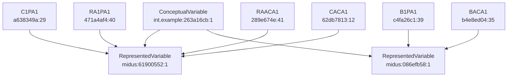

# Asset Relationship Report: P1_ConceptualVariable_67 - Physical Health Self-Evaluated

Source repository: https://midus.colectica.org/
Generated: 2026-05-25
Method: live reads via Colectica MCP (`mcp_colectica-mcp_get_item_json`)

## 1) Scope

This report maps relationships between metadata assets connected to:

- ConceptualVariable `int.example:263a16cb-f147-4af7-946b-a8efd3c48bd2:1`

## 2) Verified Assets (retrieved from MCP)

| Type | Name/Label | Agency | Identifier | Version |
|---|---|---|---|---|
| ConceptualVariable | P1_ConceptualVariable_67 | int.example | 263a16cb-f147-4af7-946b-a8efd3c48bd2 | 1 |
| RepresentedVariable | C1PA1 | midus.wisc.edu | 61900552-67c1-42c3-853a-c8ad9ac5ee3c | 1 |
| RepresentedVariable | B1PA1 | midus.wisc.edu | 086efb58-0fec-4494-96d5-78f0afc57d53 | 1 |
| Variable | C1PA1 | midus.wisc.edu | a638349a-1ebd-4ba1-9af1-03c2d753c434 | 29 |
| Variable | B1PA1 | midus.wisc.edu | c4fa26c1-d281-4e6e-bb59-f197453eec99 | 39 |
| Variable | BACA1 | midus.wisc.edu | b4e8ed04-e148-479a-85f1-91f5c1f7e5a7 | 35 |
| Variable | RA1PA1 | midus.wisc.edu | 471a4af4-ea33-4145-8ce9-fe175f61c2c6 | 40 |
| Variable | RAACA1 | midus.wisc.edu | 289e674e-9486-4686-9db6-5bc9d469f3f5 | 41 |
| Variable (Concordance) | CACA1 | example.org | 62db7813-6527-4713-9fb6-ee0fba033228 | 12 |
| CodeScheme | EXCELLENT, VERY GOOD, GOOD | example.org | a76dd331-369c-4314-9c67-21c389a67206 | 1 |

## 3) Relationship Edges

### 3.1 Conceptual model edges

| From | Relationship | To |
|---|---|---|
| ConceptualVariable `int.example:263a16cb...:1` | conceptualized_as | RepresentedVariable `midus.wisc.edu:61900552...:1` |
| ConceptualVariable `int.example:263a16cb...:1` | conceptualized_as | RepresentedVariable `midus.wisc.edu:086efb58...:1` |

### 3.2 Variable to represented-variable edges

| From (Variable) | Relationship | To (RepresentedVariable) |
|---|---|---|
| C1PA1 `a638349a...:29` | represented_by | `61900552...:1` |
| RA1PA1 `471a4af4...:40` | represented_by | `61900552...:1` |
| RAACA1 `289e674e...:41` | represented_by | `61900552...:1` |
| B1PA1 `c4fa26c1...:39` | represented_by | `086efb58...:1` |
| BACA1 `b4e8ed04...:35` | represented_by | `086efb58...:1` |
| CACA1 `62db7813...:12` | represented_by | `61900552...:1` |

### 3.3 Variable to source-question edges

| Variable | Relationship | SourceQuestion |
|---|---|---|
| C1PA1 | sourced_from | `midus.wisc.edu:174c4563-eb22-443a-98da-c3d1a32318b3:2` |
| B1PA1 | sourced_from | `int.example:d5c46161-4222-43ab-91ef-89a294866028:1` |
| BACA1 | sourced_from | `int.example:446714a3-8ab2-4d3c-af5a-5d93c00af1d9:1` |
| RA1PA1 | sourced_from | `int.example:dc99745b-b5c8-4a63-9a0c-363b0f6a1c2f:1` |
| RAACA1 | sourced_from | `int.example:6e0894a5-5207-4376-92e9-05234ce7807b:1` |
| CACA1 | sourced_from | `example.org:19b2d7ce-cbce-4695-a26d-68f733349252:2` |
| CACA1 | sourced_from | `example.org:2698874c-a19a-419e-b25d-b989a2fef47a:1` |
| CACA1 | sourced_from | `example.org:a225bbd7-8484-4da5-a9fe-8ecee144ff96:1` |

### 3.4 Variable to code-scheme edges

| Variable | Relationship | CodeScheme (from CodeRepresentation.Codes) |
|---|---|---|
| C1PA1 | coded_by | `midus.wisc.edu:6d9728a2-52a8-4e79-9bbe-71e69df80b04:10` |
| B1PA1 | coded_by | `midus.wisc.edu:44e77a2b-0ae2-49c3-a182-b8ea2aead7b6:9` |
| BACA1 | coded_by | `midus.wisc.edu:3c960707-a2dd-4d6c-8696-f20d954bdaa1:11` |
| RA1PA1 | coded_by | `midus.wisc.edu:479c2f16-8a64-4a44-84ac-690ff50a779c:1` |
| RAACA1 | coded_by | `midus.wisc.edu:d284eb3a-f7f6-43e6-a7ef-54b479a1a191:1` |
| CACA1 | coded_by | `example.org:6b4e4d58-621b-48e0-99dc-6aa88fde9c83:1` |

Additional explicit code scheme retrieved:

| CodeScheme | Agency | Identifier | Version | Values |
|---|---|---|---|---|
| EXCELLENT, VERY GOOD, GOOD | example.org | a76dd331-369c-4314-9c67-21c389a67206 | 1 | 1,2,3,4,5,7,8 |

## 4) Relationship Diagram

## 5) Integrity Notes

- The ConceptualVariable custom field states: "The M1 version of this variable is reverse coded."
- Missing value handling differs by variable (for example, B1PA1 includes code `9` and `BlankIsMissingValue=true`; C1PA1 does not).
- The concordance variable CACA1 links to represented variable `61900552...:1`, while using an example.org code scheme in its own CodeRepresentation.

## 6) Gaps / follow-up checks

- RAACA1 has now been resolved and included using live MCP retrieval:
    - Variable: `midus.wisc.edu:289e674e-9486-4686-9db6-5bc9d469f3f5:41`
    - RepresentedVariable: `midus.wisc.edu:61900552-67c1-42c3-853a-c8ad9ac5ee3c:1`
    - SourceQuestion: `int.example:6e0894a5-5207-4376-92e9-05234ce7807b:1`
    - CodeScheme link: `midus.wisc.edu:d284eb3a-f7f6-43e6-a7ef-54b479a1a191:1`
