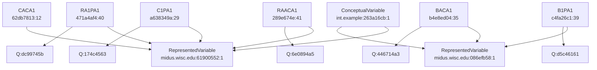
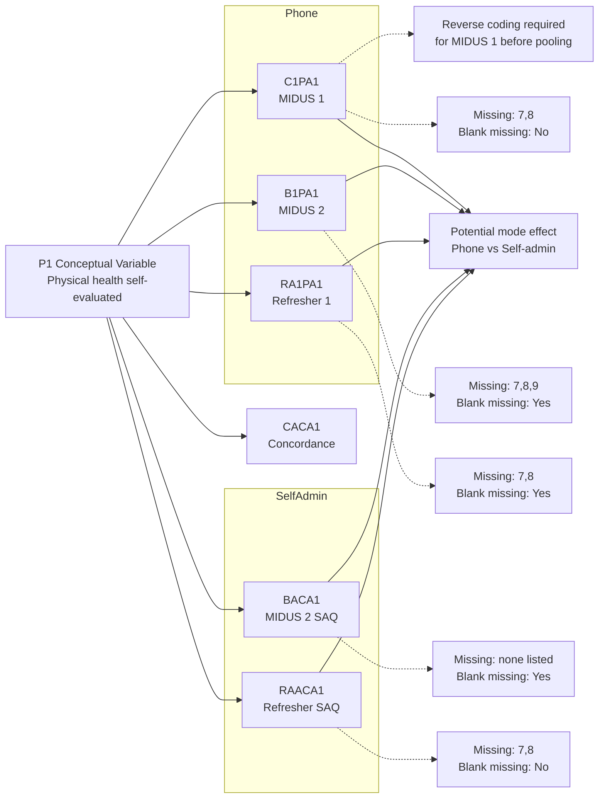
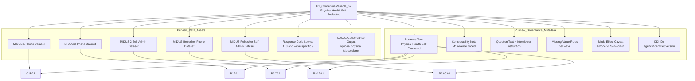

# Metadata Report: P1_ConceptualVariable_67 — Physical Health Self-Evaluated

**Source:** MIDUS Colectica Repository (<https://midus.colectica.org/>)  
**ConceptualVariable DDI URN:** `urn:ddi:int.example:263a16cb-f147-4af7-946b-a8efd3c48bd2:1`  
**Generated:** 2026-05-22  
**Tools used:** `mcp_colectica-mcp2_*` (colectica-mcp-server, `Keayoub/colectica-mcp-server`)

---

## 1 · Conceptual Variable

| Field | Value |
|---|---|
| Label | Physical health self-evaluated |
| Comparability Class | Coding Scheme |
| ⚠️ Comparability Notes | **The M1 version of this variable is reverse coded** |
| Version Rationale | Redo project 1 concordance |
| Created | 2020-12-23 by jeremy@colectica.com |
| Agency | int.example |
| Identifier | 263a16cb-f147-4af7-946b-a8efd3c48bd2 |
| Version | 1 |

---

## 2 · Cross-Wave Variable Inventory

| Variable | Study / Mode | Agency | Identifier | Version | Last Updated | Missing Codes | Blank = Miss? |
|---|---|---|---|---|---|---|---|
| **C1PA1** | MIDUS 1 — Phone Interview | midus.wisc.edu | a638349a-1ebd-4ba1-9af1-03c2d753c434 | 29 | 2025-12-09 (jporter@wisc.edu) | 7, 8 | No |
| **B1PA1** | MIDUS 2 — Phone Interview | midus.wisc.edu | c4fa26c1-d281-4e6e-bb59-f197453eec99 | 39 | 2020-12-23 (jeremy@colectica.com) | 7, 8, 9 | Yes |
| **BACA1** | MIDUS 2 — Self-Administered | midus.wisc.edu | b4e8ed04-e148-479a-85f1-91f5c1f7e5a7 | 35 | 2025-05-12 (jporter@wisc.edu) | *(none listed)* | Yes |
| **RA1PA1** | MIDUS Refresher 1 — Phone Interview | midus.wisc.edu | 471a4af4-ea33-4145-8ce9-fe175f61c2c6 | 40 | 2025-04-16 (jporter@wisc.edu) | 7, 8 | Yes |
| **RAACA1** | MIDUS Refresher — Self-Administered | midus.wisc.edu | 289e674e-9486-4686-9db6-5bc9d469f3f5 | 41 | — | 7, 8 | No |
| **CACA1** | Concordance (M3P1 + MKE2) | example.org | 62db7813-6527-4713-9fb6-ee0fba033228 | 12 | — (VersionRationale: "Update M3P1 and MKE2") | 7, 8 | — |

> **Note:** The Colectica repository stores DDI metadata only.
> Frequency statistics (N, %, means) are not stored and must be obtained from MIDUS data files at <https://midus.wisc.edu/>.

---

## 3 · Question Instrument

### 3a. Question Literal (identical across all waves)

> In general, would you say your PHYSICAL HEALTH is excellent, very good, good, fair, or poor?

### 3b. Pre-Question Text

| Variable | Pre-Question Text |
|---|---|
| C1PA1 (MIDUS 1 phone) | Now I would like to ask you about your health. |
| RA1PA1 (Refresher 1 phone) | Now I would like to ask you about your health. |
| B1PA1 (MIDUS 2 phone) | The first questions are about your health. |
| BACA1 (MIDUS 2 self-admin) | The first questions are about your health. |
| RAACA1 (Refresher self-admin) | The first questions are about your health. |

### 3c. Interviewer Instruction (phone interviews)

> INTERVIEWER: IF R SAYS "I'm not a doctor...", PROBE: "What do YOU think?"

---

## 4 · Response Scale

**Concordance CodeScheme:** `example.org:a76dd331-369c-4314-9c67-21c389a67206:1`  
**Label:** "EXCELLENT, VERY GOOD, GOOD"

| Code | Label | Type |
|---|---|---|
| 1 | EXCELLENT | Valid |
| 2 | VERY GOOD | Valid |
| 3 | GOOD | Valid |
| 4 | FAIR | Valid |
| 5 | POOR | Valid |
| 7 | *(Refused / Not Applicable)* | Missing |
| 8 | *(Don't Know)* | Missing |
| 9 | *(Blank / Not Answered)* | Missing — B1PA1 (MIDUS 2 phone) only |

---

## 5 · Comparability Flags

| Flag | Detail |
|---|---|
| **⚠️ Reverse coding in M1** | The ConceptualVariable explicitly notes that the MIDUS 1 version (C1PA1) is **reverse coded** relative to all subsequent waves. Before pooling data across waves, researchers must recode C1PA1 (e.g., recode 1→5, 2→4, 4→2, 5→1). |
| **Missing code difference** | MIDUS 2 phone (B1PA1) adds code 9 and treats blank as missing; MIDUS 1 (C1PA1) does not declare code 9 and does not treat blank as missing. |
| **Pre-question wording** | Minor wording difference in preamble between MIDUS 1/Refresher ("Now I would like to ask…") vs MIDUS 2 ("The first questions are…"). |
| **Mode effect risk** | Self-administered (BACA1, RAACA1) and phone interview (C1PA1, B1PA1, RA1PA1) versions use different source QuestionItems — a potential mode effect on response distributions. |

---

## 6 · DDI Relationship Structure

```
ConceptualVariable: int.example:263a16cb:1
  "Physical health self-evaluated"
  ├─ RepresentedVariable: midus.wisc.edu:61900552:1
  │    └─ Variable: C1PA1  (a638349a, v29)  [MIDUS 1 phone]
  │    └─ Variable: RA1PA1 (471a4af4, v40)  [Refresher phone]
  │    └─ Variable: RAACA1 (289e674e, v41)  [Refresher self-admin]
  │
  ├─ RepresentedVariable: midus.wisc.edu:086efb58:1
  │    └─ Variable: B1PA1  (c4fa26c1, v39)  [MIDUS 2 phone]
  │    └─ Variable: BACA1  (b4e8ed04, v35)  [MIDUS 2 self-admin]
  │
  └─ Concordance Variable: CACA1 (example.org:62db7813, v12)
       └─ CodeScheme: example.org:a76dd331:1
            Codes: 1=EXCELLENT 2=VERY GOOD 3=GOOD 4=FAIR 5=POOR 7=Refused 8=DK

Source QuestionItems (int.example):
  174c4563  →  C1PA1 (MIDUS 1 phone)
  d5c46161  →  B1PA1 (MIDUS 2 phone)
  446714a3  →  BACA1 (MIDUS 2 self-admin)
  dc99745b  →  RA1PA1 (Refresher phone)
  6e0894a5  →  RAACA1 (Refresher self-admin)
```

---

## 7 · Mermaid Survey Relationship Graphic



---

## 8 · Mermaid Cross-Wave Comparability Graphic



---

## 9 · Purview Data Asset Mapping (Visual)



---

## 10 · Repository Item Type GUIDs (Reference)

| Item Type | GUID |
|---|---|
| Variable | `683889c6-f74b-4d5e-92ed-908c0a42bb2d` |
| QuestionItem | `a1bb19bd-a24a-4443-8728-a6ad80eb42b8` |
| ConceptualVariable | `75f63016-b4f8-45b6-953c-f7ac7364fc25` |
| Category | `7e47c269-bcab-40f7-a778-af7bbc4e3d00` |
| CodeScheme | `8b108ef8-b642-4484-9c49-f88e4bf7cf1d` |
| ManagedMissingValuesRepresentation | `c29c3125-2a53-4179-8fa6-aa3beb2bb5ed` |

---

## 11 · Retrieval Commands (colectica-mcp2)

Re-fetch any item using these identifiers:

```python
# ConceptualVariable
get_item_json(agency="int.example", identifier="263a16cb-f147-4af7-946b-a8efd3c48bd2", version=1)

# Wave variables
get_item_json(agency="midus.wisc.edu", identifier="a638349a-1ebd-4ba1-9af1-03c2d753c434", version=29)  # C1PA1
get_item_json(agency="midus.wisc.edu", identifier="c4fa26c1-d281-4e6e-bb59-f197453eec99", version=39)  # B1PA1
get_item_json(agency="midus.wisc.edu", identifier="b4e8ed04-e148-479a-85f1-91f5c1f7e5a7", version=35)  # BACA1
get_item_json(agency="midus.wisc.edu", identifier="471a4af4-ea33-4145-8ce9-fe175f61c2c6", version=40)  # RA1PA1
get_item_json(agency="midus.wisc.edu", identifier="289e674e-9486-4686-9db6-5bc9d469f3f5", version=41)  # RAACA1

# Concordance variable
get_item_json(agency="example.org",   identifier="62db7813-6527-4713-9fb6-ee0fba033228", version=12)  # CACA1

# Concordance CodeScheme
get_item_json(agency="example.org",   identifier="a76dd331-369c-4314-9c67-21c389a67206", version=1)   # CodeScheme

# Search for all cross-wave variables linked to this concept
search(body={"SearchTerms": ["PA1"], "ItemTypes": ["Variable"], "MaxResults": 25})
```
